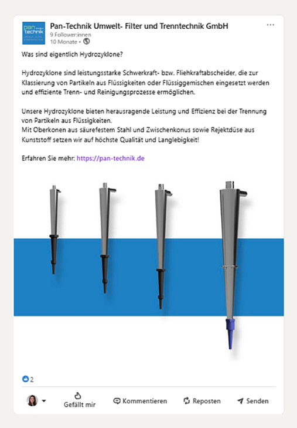
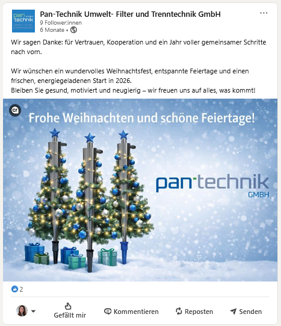

# LinkedIn Communication Showcase

Examples of LinkedIn content created for an industrial technology company.

---

## About

This showcase presents selected LinkedIn posts covering technical topics,
product communication and company communication.

The examples demonstrate how complex information can be communicated in a clear and visually engaging format.

---

## Example 1: What Are Hydrocyclones?

A post introducing the basic principles and applications of hydrocyclones in an accessible format.

---

## Example 2: Product Portfolio Overview

An overview of different hydrocyclone solutions and their industrial applications.

---

## Example 3: Product Comparison

A visual comparison supporting the selection of different hydrocyclone variants.

---

## Example 4: Holiday Greeting

A seasonal post supporting company communication and visibility.

